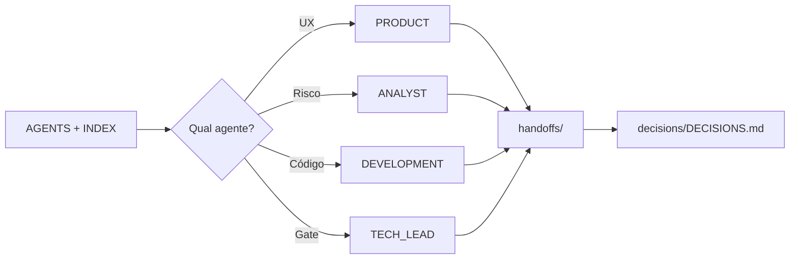

# Fluxo multi-agent — uso em outro chat

Objetivo: trabalhar **sem depender** de conversas anteriores. Estado vive no repositório (`handoffs/`, `decisions/`, `docs/`, `architecture/`).

**Política do dono:** handoff só vira arquivo em `handoffs/` **depois de aprovação explícita** — ver `AGENTS.md` §6. **PRODUCT, ANALYST e design/copy** não editam implementação — ver `AGENTS.md` §7.1.

## Forma recomendada: `/` no Agent Chat

1. Abra o workspace **bot-rpg-telegram**.
2. No chat do **Agent**, digite **`/`** e selecione o comando do projeto:
   - **`/rpg-session`** — contexto inicial (AGENTS + índice + último handoff). Se **não aparecer**, use **`/rpg-bootstrap`** (mesmo conteúdo).
   - **`/rpg-product`** | **`/rpg-bot-copy`** | **`/rpg-analyst`** | **`/rpg-dev`** | **`/rpg-tech-lead`** — um agente por vez.
   - **`/rpg-fluxo-mvp`** — fluxo **pronto** da Feature 1 (personagem), com fases PRODUCT → ANALYST → TECH_LEAD (se preciso) → DEV.
3. Na mesma mensagem ou na seguinte, digite **o que você quer** (tarefa ou “fluxo completo”).

Os comandos são arquivos Markdown em **`.cursor/commands/`** (ex.: `rpg-session.md` → `/rpg-session`).

## Uso individual de um só agente

Você **não** precisa rodar PRODUCT → ANALYST → DEV em sequência a menos que use `/rpg-fluxo-mvp` ou peça explicitamente.

- Só código: `/rpg-dev` + seu pedido.
- Só UX / fluxo: `/rpg-product` + seu pedido.
- Só copy do bot: `/rpg-bot-copy` + seu pedido.
- Chat novo com tarefa grande: opcionalmente `/rpg-session` ou `/rpg-bootstrap` primeiro, depois o agente desejado.

## Alternativa: copiar prompt de `docs/prompts/`

1. `@AGENTS.md` + `@index/PROJECT_INDEX.md` (opcional mas útil).
2. Copie o bloco entre `---COPIAR DAQUI---` e `---COPIAR ATÉ AQUI---` do arquivo desejado:

| Objetivo | Arquivo |
|----------|---------|
| Prefixo (leitura obrigatória) | `docs/prompts/INICIO-SESSAO.md` |
| PRODUCT | `docs/prompts/PRODUCT_AGENT.md` |
| ANALYST | `docs/prompts/ANALYST_AGENT.md` |
| DEVELOPMENT | `docs/prompts/DEVELOPMENT_AGENT.md` |
| TECH_LEAD | `docs/prompts/TECH_LEAD_AGENT.md` |

## Dar a tarefa

Depois do **`/rpg-*`** ou do prompt colado, escreva em português claro, por exemplo:

- “Atualize o fluxo de criação de personagem para incluir confirmação antes de salvar.”
- “Revise o handoff anterior e valide se o schema Prisma quebra o módulo inventory no M2.”
- “Implemente o endpoint X seguindo ARCHITECTURE.md.”

## Handoff obrigatório

Ao encerrar um ciclo útil de trabalho, peça explicitamente:

> Gere o HANDOFF no formato de `AGENTS.md` seção 6 **no chat**; **aguarde aprovação explícita do dono**; só então crie/atualize `handoffs/YYYY-MM-DD-descricao-curta.md`.

Assim o **próximo** chat só precisa ler o último handoff + índice.

## Decisões arquiteturais

Se mudou stack, boundaries ou dependências novas: atualize `decisions/DECISIONS.md` (ADR). O TECH_LEAD_AGENT ou DEVELOPMENT_AGENT podem propor; TECH_LEAD **aprova** mudanças grandes.

## Diagrama rápido

## Troubleshooting

- **`/` não lista `rpg-*`:** confira se o workspace é a raiz do repo; arquivos em `.cursor/commands/`; **Reload Window**; atualize o Cursor. Se só **`/rpg-session`** sumir, use **`/rpg-bootstrap`**.
- **“O modelo não leu o handoff”:** repita `@handoffs/nome-do-arquivo-mais-recente.md` e peça resumo antes de codar.
- **Ambiguidade de regra de jogo:** não implementar; PRODUCT_AGENT ou decisão em `DECISIONS.md`.
- **Primeiro clone sem código:** normal; `PROJECT_INDEX.md` indica estado; primeiro DEVELOPMENT_AGENT pode fazer scaffold após TECH_LEAD aprovar dependências.
