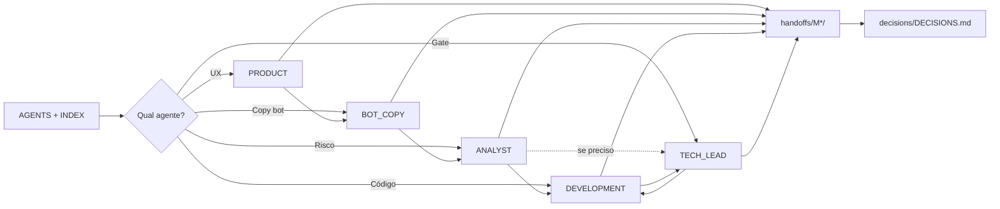

# Fluxo multi-agent — diagrama, prompts coláveis e troubleshooting

Objetivo: complementar **[COMO-USAR-AGENTS.md](./COMO-USAR-AGENTS.md)** (tabela canónica de comandos e checklist linear). Estado do projeto vive no repositório (`handoffs/M*/`, `decisions/`, `docs/`, `architecture/`).

**Política do dono, handoff e limites de código:** um só lugar — **`AGENTS.md`** §6, §7.1 e **`index/PROJECT_PHASE.md`** (pasta `handoffs/<M>/`). Nomes de ficheiro: `handoffs/README.md`.

## Comandos `/` e passo a passo

Não duplicar aqui: ver **[COMO-USAR-AGENTS.md](./COMO-USAR-AGENTS.md)** (tabela `rpg-*`, passos 1–4, fluxos típicos). Os ficheiros vivem em **`.cursor/commands/`** (`nome.md` → `/nome`).

## Alternativa: copiar prompt de `docs/prompts/`

1. `@AGENTS.md` + `@index/PROJECT_INDEX.md` (opcional mas útil).
2. Copie o bloco entre `---COPIAR DAQUI---` e `---COPIAR ATÉ AQUI---` do arquivo desejado:

| Objetivo | Arquivo |
|----------|---------|
| Prefixo (leitura obrigatória) | `docs/prompts/INICIO-SESSAO.md` |
| PRODUCT | `docs/prompts/PRODUCT_AGENT.md` |
| BOT_COPY (copy do bot, sem código) | `docs/prompts/BOT_COPY_AGENT.md` |
| ANALYST | `docs/prompts/ANALYST_AGENT.md` |
| DEVELOPMENT | `docs/prompts/DEVELOPMENT_AGENT.md` |
| TECH_LEAD | `docs/prompts/TECH_LEAD_AGENT.md` |

## Dar a tarefa

Depois do **`/rpg-*`** ou do prompt colado, escreva em português claro, por exemplo:

- “Atualize o fluxo de criação de personagem para incluir confirmação antes de salvar.”
- “Revise o handoff anterior e valide se o schema Prisma quebra o módulo inventory no M2.”
- “Implemente o endpoint X seguindo ARCHITECTURE.md.”

## Decisões arquiteturais

Se mudou stack, boundaries ou dependências novas: atualize `decisions/DECISIONS.md` (ADR). O TECH_LEAD_AGENT ou DEVELOPMENT_AGENT podem propor; TECH_LEAD **aprova** mudanças grandes.

## Diagrama rápido

Linhas **sólidas** no miolo: pipeline do **`/rpg-fluxo-mvp`** (PRODUCT → BOT_COPY → ANALYST → DEV), **repetido por marco M1…M5** quando pedir fluxo completo. **TECH_LEAD** entra quando houver gate estrutural. Atalhos (só um agente): ver **Fluxos típicos** em [COMO-USAR-AGENTS.md](./COMO-USAR-AGENTS.md); opcionalidade em `AGENTS.md` §5.

## Troubleshooting

- **`/` não lista `rpg-*`:** confira se o workspace é a raiz do repo; arquivos em `.cursor/commands/`; **Reload Window**; atualize o Cursor. Se só **`/rpg-session`** sumir, use **`/rpg-bootstrap`**.
- **“O modelo não leu o handoff”:** repita `@handoffs/M1/nome-do-arquivo-mais-recente.md` (ou a pasta do marco em `PROJECT_PHASE`) e peça resumo antes de codar. Handoffs: `YYYY-MM-DD-slug.md` dentro da pasta certa — ver [`handoffs/README.md`](../handoffs/README.md) e [`index/PROJECT_PHASE.md`](../index/PROJECT_PHASE.md).
- **Ambiguidade de regra de jogo:** não implementar; PRODUCT_AGENT ou decisão em `DECISIONS.md`.
- **Primeiro clone sem código:** normal; `PROJECT_INDEX.md` indica estado; primeiro DEVELOPMENT_AGENT pode fazer scaffold após TECH_LEAD aprovar dependências.
