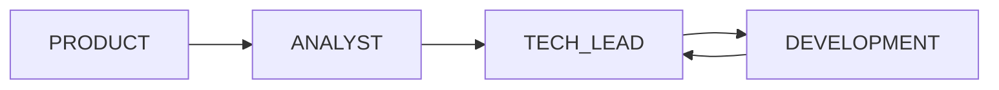

# AGENTS_ECOSYSTEM — Mapa do multi-agent

Visão do **ecossistema de agents** deste repositório: onde cada peça vive e como se encadeia. Complementa `AGENTS.md` com uma indexação operacional.

## Fonte de verdade

| Camada | Arquivo / pasta | Papel |
|--------|-------------------|--------|
| Personas e processo | `AGENTS.md` | PRODUCT, ANALYST, DEVELOPMENT, TECH_LEAD; handoff; charter MVP; filosofia |
| Entrada doc | `index/PROJECT_INDEX.md` | Ordem de leitura e estado do repo |
| Regra Cursor | `.cursor/rules/bot-rpg-multi-agent.mdc` | Lembra AGENTS, índice, handoffs, limites (sem RN em handler, sem deps sem gate) |

## Comandos slash (Cursor Agent Chat)

Arquivos em `.cursor/commands/` viram comandos `/nome` no chat:

| Comando | Agente / uso |
|---------|----------------|
| `/rpg-session` ou `/rpg-bootstrap` | Carregar contexto (índice + handoff + fluxo) |
| `/rpg-product` | PRODUCT_AGENT — UX Telegram, fluxos, textos |
| `/rpg-bot-copy` | BOT_COPY_AGENT — copy e mensagens do bot (sem editar código) |
| `/rpg-analyst` | ANALYST_AGENT — riscos, domínio, sustentabilidade |
| `/rpg-dev` | DEVELOPMENT_AGENT — Nest, Prisma, bot |
| `/rpg-tech-lead` | TECH_LEAD_AGENT — gate arquitetural, ADRs |
| `/rpg-fluxo-mvp` | Sequência pronta Feature 1 (personagem) |

Cada `.md` em `commands/` resume missão, referências (`AGENTS.md`, `docs/MODULES.md`) e obrigação de handoff.

## Prompts coláveis (sem depender de slash)

| Arquivo | Equivalente |
|---------|-------------|
| `docs/prompts/INICIO-SESSAO.md` | Sessão / bootstrap |
| `docs/prompts/PRODUCT_AGENT.md` | PRODUCT |
| `docs/prompts/ANALYST_AGENT.md` | ANALYST |
| `docs/prompts/DEVELOPMENT_AGENT.md` | DEV |
| `docs/prompts/TECH_LEAD_AGENT.md` | TECH_LEAD |
| `docs/prompts/README.md` | Índice dos prompts |

Guias longos: `docs/COMO-USAR-AGENTS.md`, `docs/FLUXO_MULTI_AGENT.md`, `docs/PROMPT_NOVO_CHAT.md`.

## Fluxo recomendado (features)

- **Ideação / UX chat:** PRODUCT  
- **Dúvida de escopo ou risco:** ANALYST  
- **Dependência nova ou boundary:** TECH_LEAD antes (e depois revisão)  
- **Implementação:** DEVELOPMENT  

Feature mínima personagem: charter em `AGENTS.md` §8 e `docs/MODULES.md` MVP; fluxo detalhado em `docs/fluxos/mvp-personagem.md`.

## Memória entre chats

1. `handoffs/` — último arquivo por data no nome (`YYYY-MM-DD-slug.md`), formato §6 de `AGENTS.md`; arquivos só devem existir **após o dono aprovar** o handoff no chat (§6 fluxo).  
2. `decisions/DECISIONS.md` — decisões que mudam stack ou módulos  
3. Este índice e `CODEBASE_INDEX.md` — onde está o código  

**Alterações documentadas para agents:** índice do repo (`CODEBASE_INDEX.md`), este ecosystem map e design de mensagens (`AGENT_DESIGN_BOT_TELEGRAM.md`) — também listados na §2 de `AGENTS.md`.

**Fronteira de código:** PRODUCT, ANALYST e BOT_COPY/design **não** editam `src/`, Prisma de schema/migrations, `package.json`, etc. (`AGENTS.md` §7.1).

## Fronteira técnica relevante aos agents

- **Handlers / `BotService`:** só orquestração; regras em `CharacterService` e domínio.  
- **Copy e labels:** `src/bot/bot.copy.ts`, `bot.labels.ts`, formatação em `bot.presenter.ts` — ver `index/AGENT_DESIGN_BOT_TELEGRAM.md` para padronizar mensagens.

## Extensões futuras do ecossistema

- Novo agente: prompt em `docs/prompts/`, comando em `.cursor/commands/`, linha na tabela §9 de `AGENTS.md` e neste mapa. **BOT_COPY** já usa `/rpg-bot-copy` + `BOT_COPY_AGENT.md`.
